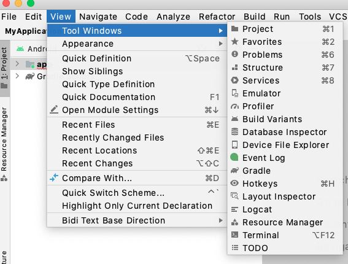
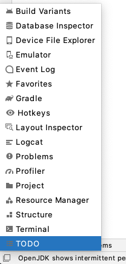

<h1 align="center" style="text-align: center; padding-bottom: 20px;">
  <br>
  <a href="http://www.sachinkasaraddi.com"></a>
  <br>
  Hotkeys
  <br>
</h1>

<h4 align="center">This simple Android Studio plugin includes keyboard shortcuts for many common actions.</h4>

<p align="center">


</p>

<p align="center">
  <a href="#Features">Features</a> •
  <a href="#build-process">Build process</a> •
  <a href="#contribute">Contribute</a> •
  <a href="#Licence">License</a>
</p>

<!-- blank line -->
<iframe frameborder="none" width="245px" height="48px" src="https://plugins.jetbrains.com/embeddable/install/17027"></iframe>
<!-- blank line -->

## Features
This simple Android Studio plugin includes keyboard shortcuts for many common actions and shows the default keyboard shortcuts by operating system.
* General
* Navigating and searching within Studio
* Viewing layouts
* Design tools: Layout Editor
* Design tools: Navigation Editor
* Writing code
* Build and run
* Debugging
* Refactoring
* Version control / local history
 
## Usage

From the main menu, select a tool window under View | Tool Windows | Hotkeys.



To show or hide the entire tool window bar, click the window icon  in the bottom left-hand corner of the Android Studio window.



## Contribute

If you notice any bugs in the plugin, see some code that can be improved, or have features you would like to be added, please [file an issue](https://github.com/SachinKasaraddi/Hotkeys/issues/new).

If you want to open a PR that fixes a bug or adds a feature, then I can't thank you enough! It is definitely appreciated if an issue has been created before-hand so it can be discussed first.

## Build Process

**Use IntelliJ IDEA 2020.2.3 (Community Edition)**

* Clone or download the repo
* Import project and build


## Authors

- [@SachinKasaraddi](https://github.com/SachinKasaraddi)

##Licence

```
MIT License

Copyright (c) 2021 SACHIN KASARADDI

Permission is hereby granted, free of charge, to any person obtaining a copy
of this software and associated documentation files (the "Software"), to deal
in the Software without restriction, including without limitation the rights
to use, copy, modify, merge, publish, distribute, sublicense, and/or sell
copies of the Software, and to permit persons to whom the Software is
furnished to do so, subject to the following conditions:

The above copyright notice and this permission notice shall be included in all
copies or substantial portions of the Software.

THE SOFTWARE IS PROVIDED "AS IS", WITHOUT WARRANTY OF ANY KIND, EXPRESS OR
IMPLIED, INCLUDING BUT NOT LIMITED TO THE WARRANTIES OF MERCHANTABILITY,
FITNESS FOR A PARTICULAR PURPOSE AND NONINFRINGEMENT. IN NO EVENT SHALL THE
AUTHORS OR COPYRIGHT HOLDERS BE LIABLE FOR ANY CLAIM, DAMAGES OR OTHER
LIABILITY, WHETHER IN AN ACTION OF CONTRACT, TORT OR OTHERWISE, ARISING FROM,
OUT OF OR IN CONNECTION WITH THE SOFTWARE OR THE USE OR OTHER DEALINGS IN THE
SOFTWARE.```